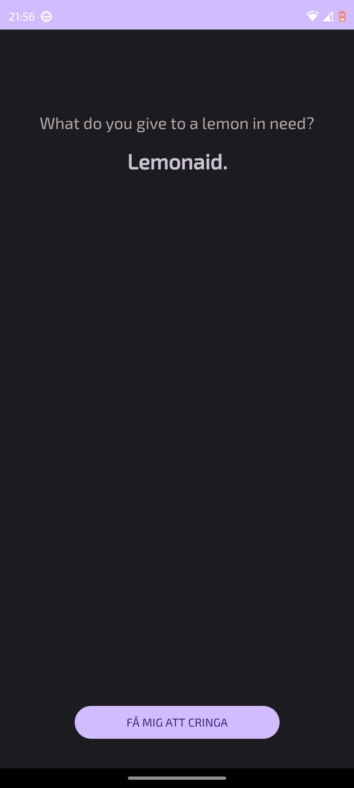

# The Cringe Button 🎙️

A modern Android application that fetches and displays "dad jokes" from a REST API. This project was built to explore Kotlin development, Android Jetpack components, and modern asynchronous programming.

  

## Features
- **Real-time API Integration:** Fetches random jokes from the Official Joke API.
- **Coroutines & Thread Management:** Uses Kotlin Coroutines for non-blocking network calls.
- **Modern UI:** A clean, dark-themed interface built with ConstraintLayout and Material Design.
- **Lifecycle Awareness:** Implements `lifecycleScope` to prevent memory leaks and handle activity destruction gracefully.
- **Anti-Spam Logic:** Button debouncing to prevent multiple simultaneous API requests.

## Tech Stack
- **Language:** [Kotlin](https://kotlinlang.org/)
- **Asynchronous Logic:** [Kotlin Coroutines](https://kotlinlang.org/docs/coroutines-overview.html)
- **UI Framework:** Android XML (ConstraintLayout)
- **Networking:** Standard Java/Kotlin URL connection (with `withContext(Dispatchers.IO)`)
- **JSON Parsing:** `org.json` library

## Key Learnings
This project served as a deep dive into the Android ecosystem:
- **Asynchronous Programming:** Moving from basic threads to Coroutines for safer and more readable code.
- **Android Lifecycle:** Understanding how to scope background tasks to the activity's lifecycle.
- **Resource Management:** Using `dp` and `sp` units to ensure a consistent UI across different screen densities.
- **Manifest Permissions:** Handling internet access requirements in Android.

## How to Run
1. Clone this repository.
2. Open the project in **Android Studio**.
3. Let Gradle sync and build the project.
4. Run the app on an emulator (API 30+) or a physical device.

---
Created by adamladan
